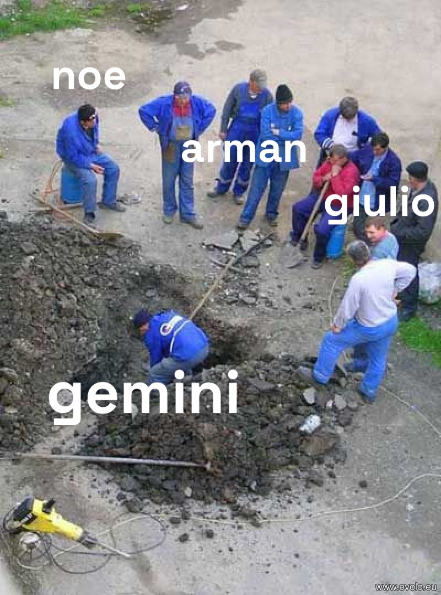

# GranolaTok: Granola-x-DeepMind-Hackathon

**Your Granola meeting notes, but watchable.**

## About the Project
GranolaTok turns your meeting transcripts from [Granola](https://www.granola.ai/) into short, scrollable, TikTok-style video recaps. Powered by **Gemini**, it extracts the most important moments—decisions, action items, and highlights—providing a format your brain already craves.

### How it Works
1. **Import**: Takes your Granola meeting transcript.
2. **Analyze**: Gemini identifies key moments and decisions.
3. **Generate**: Produces a short video recap with captions and visuals.
4. **Consume**: Swipe through your day's meetings in a vertical feed.

*Wait—why read a memo when you can watch a TikTok?*

